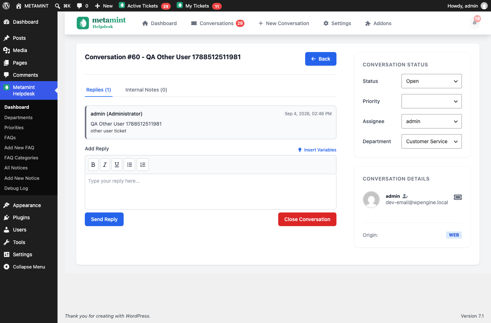
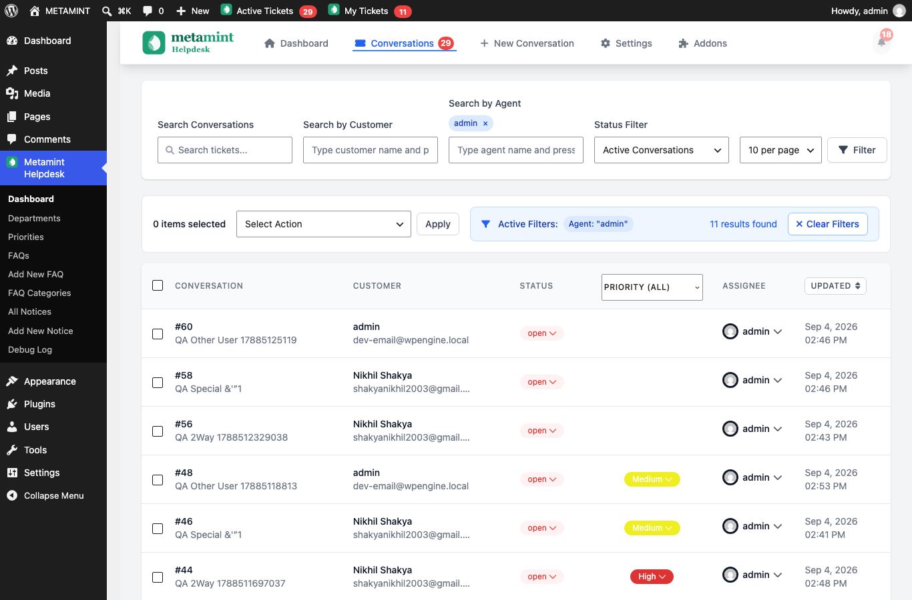
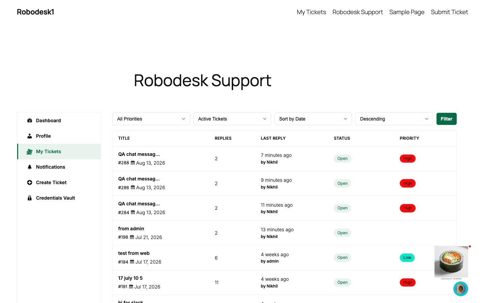
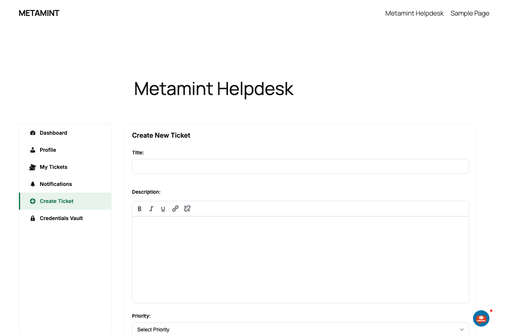
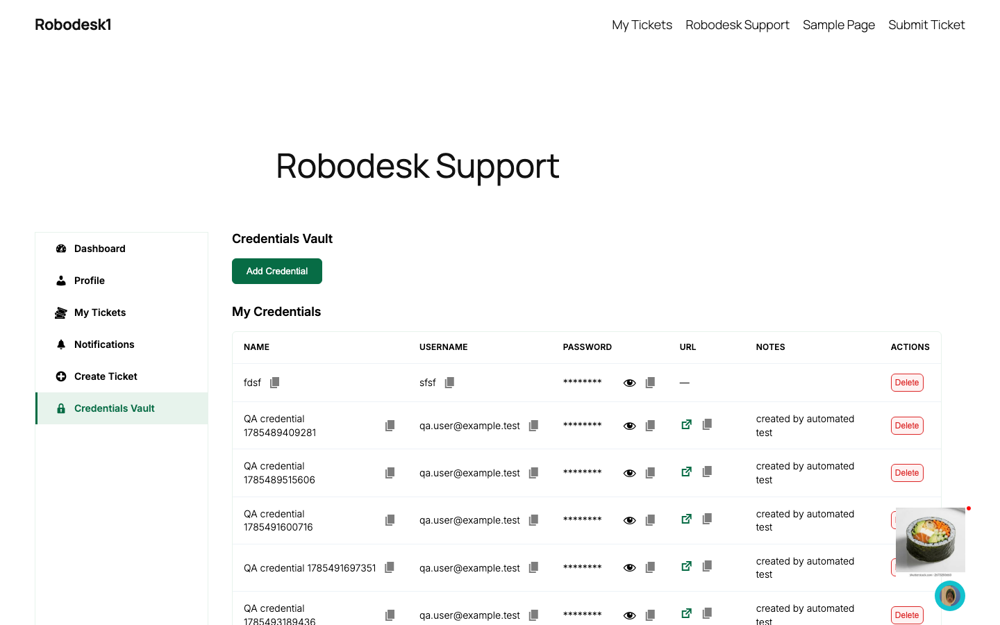
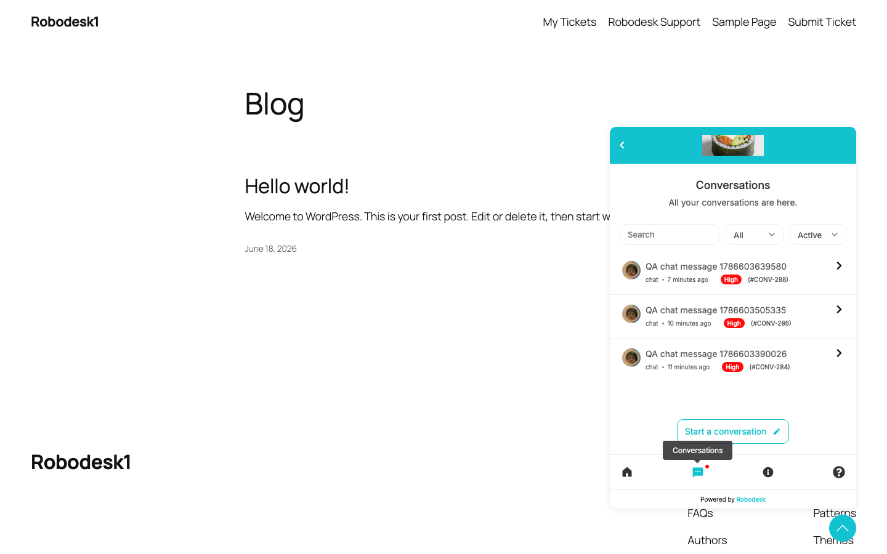
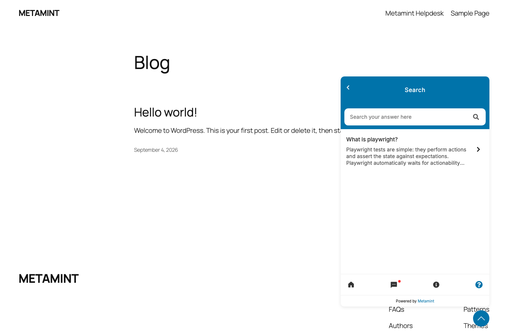

# Robodesk Local Test

End-to-end Playwright test suite for the Robodesk customer support plugin, running against a local WordPress installation (`http://robodesk1.local`).

## Prerequisites

- Node.js 20.12+ (uses `process.loadEnvFile`; tested on v24)
- Playwright browsers installed: `npx playwright install chromium`
- A running Robodesk WordPress site reachable at the configured `BASE_URL`

## Setup

```bash
npm install
npx playwright install chromium

# Configure credentials
cp .env.example .env
# edit .env with your real values
```

Credentials (`BASE_URL`, admin/customer login) live in `.env` — see `.env.example` for the template. `.env` is gitignored.

## Running the tests

Tests are organized feature-wise: one spec file per feature.

```bash
npx playwright test                     # full suite
npx playwright test admin.spec.ts       # admin features
npx playwright test auth.spec.ts        # widget login / auth
npx playwright test chat.spec.ts        # chat widget + search/filters
npx playwright test tickets.spec.ts     # my tickets, details, reply, access
npx playwright test create-ticket.spec.ts
npx playwright test credentials-vault.spec.ts
npx playwright test profile.spec.ts
npx playwright test conversation.spec.ts # two-way customer + admin conversation

# By tag
npx playwright test --grep "@smoke"
npx playwright test --grep "@regression"
npx playwright test --grep "@admin"
npx playwright test --grep "@customer"
npx playwright test --grep "@chat"

# Single test
npx playwright test tickets.spec.ts --grep "reply to ticket"
```

Reports: HTML report in `playwright-report/` (`npx playwright show-report`), plus traces/videos on failure in `test-results/`.

## What is covered

- **Auth** (`tests/auth.spec.ts`): guest prompt, widget login (existing user email + password), invalid/empty email, empty credentials (inline errors, no API call), wrong password rejection, new-user registration blocked when disabled
- **Chat widget** (`tests/chat.spec.ts`): widget presence, conversation creation, search/filters, FAQ tab (search + detail), notices tab, single-ticket chat view, image attachment, special-char search negatives
- **Tickets** (`tests/tickets.spec.ts`): my tickets list + filters, ticket details, customer reply, access negatives (another user's ticket, non-existent id)
- **Create ticket** (`tests/create-ticket.spec.ts`): TinyMCE form submit, empty-title block
- **Credentials vault** (`tests/credentials-vault.spec.ts`): add/delete credentials
- **Profile** (`tests/profile.spec.ts`): update first name (with restore)
- **Admin** (`tests/admin.spec.ts`): dashboard, profile page, ticket creation + toast, dashboard reply + status change, bulk status change, priority/assignee persistence, departments/priorities add+delete, FAQ/notice create+trash, debug log
- **Conversation** (`tests/conversation.spec.ts`): end-to-end two-way exchange on one ticket — customer replies from the chat widget, admin replies from the wp-admin backend, across two separate browser contexts

## Architecture

```
├── tests/                  # Feature-wise Playwright specs
│   ├── admin.spec.ts              # admin: login, ticket ops, bulk, taxonomies, FAQs, notices
│   ├── auth.spec.ts               # widget login / auth
│   ├── chat.spec.ts               # chat widget + search/filters
│   ├── create-ticket.spec.ts      # create ticket (submit + validation)
│   ├── credentials-vault.spec.ts  # credentials vault CRUD
│   ├── profile.spec.ts            # customer profile update
│   └── tickets.spec.ts            # my tickets, details, reply, access
├── src/
│   ├── config/env.ts       # Loads .env into typed config
│   ├── pages/              # Page Object Model
│   │   ├── basePage.ts             # goto, waitForLoading, waitForToast
│   │   ├── loginPage.ts            # wp-login flow
│   │   ├── dashboardPage.ts        # admin dashboard
│   │   ├── customerPortalPage.ts   # /robodesk-support/ guest view
│   │   ├── myTicketsPage.ts        # my-tickets list + filters
│   │   ├── createTicketPage.ts     # create-ticket form (TinyMCE-aware)
│   │   ├── credentialsVaultPage.ts # credentials vault CRUD
│   │   ├── ticketDetailsPage.ts    # ticket detail view + reply
│   │   ├── chatWidgetPage.ts       # widget open/login/chat/search/filter
│   │   ├── profilePage.ts          # wp-admin + portal profile forms
│   │   └── notificationsPage.ts
│   ├── helpers/robodeskHelpers.ts  # login, createTicket, reply, toast, etc.
│   ├── fixtures/roles.ts           # role fixtures + portalTest (session reuse)
│   └── data/fakeData.ts            # deterministic random test data
├── docs/
│   ├── tests.md            # Full test documentation
│   └── test-status.md      # Verification status per test
├── .env / .env.example     # Credentials and environment config
└── playwright.config.ts
```

## Key behaviors

- **Widget login for existing users**: the chat widget checks the email first (`wp-admin/admin-ajax.php?action=robodesk_check_email`); if the user exists, a password field appears (button changes from Continue to Login). New users are auto-registered and have no password step.
- **Portal session reuse**: `portalTest` logs the customer in once per worker through the widget and caches the session to `.state/customer-widget-storage.json`, so the portal tests don't repeatedly hit the server-side login rate limiter. Delete that file to force a fresh login.
- **Admin session reuse**: `adminTest` logs the admin in once per worker via `/wp-login.php` and caches the session to `.state/admin-wp-storage.json`; every admin feature test (including the dashboard smoke test) runs from that single cached session. Delete that file to force a fresh login.
- **Two-context conversation test**: `conversationTest` in `src/fixtures/roles.ts` provides `customerPage` (cached widget session) and `adminPage` (cached admin session) in the same test, so a single test can drive both sides of a conversation.
- **Server-side rate limiting**: the email-check endpoint allows **10 checks per IP per hour** and returns "Too many attempts. Please try again later." beyond that. All local requests share one IP, so the whole suite shares the budget. If tests hit this, wait for the hourly transient to expire. The actual password login (`/wp-json/robodesk/v1/login`) is not rate limited.
- **TinyMCE**: the create-ticket description is a hidden `textarea#ticket_content`; tests type into `iframe#ticket_content_ifr`. The customer reply editor on ticket details is `iframe#comment_ifr`.
- **Admin reply/status**: done from the Robodesk dashboard ticket view (`admin.php?page=robodesk-dashboard&tab=dashboard&ticket=N`), replying via the `#new-reply` editor and `#send-reply-btn`, changing status via `#ticket-status-select`.
- **Vault delete**: deletion uses a native `confirm()` dialog, which the page object accepts.

## Screenshots

Captured from the live local site (logged-in sessions) using the same flows the tests exercise.

### Admin

| Admin ticket view (reply + status) | All tickets view (bulk actions) |
| --- | --- |
|  |  |

### Support portal (customer)

| My tickets | Create ticket | Credentials vault |
| --- | --- | --- |
|  |  |  |

### Chat widget (customer, logged in)

| Conversations tab | FAQ tab |
| --- | --- |
|  |  |

Screenshots live in `docs/screenshots/`. Re-capture any time with a logged-in session (they reflect the current site data).

## Documentation

- `docs/tests.md` — detailed test-by-test documentation
- `docs/test-status.md` — current verification status
